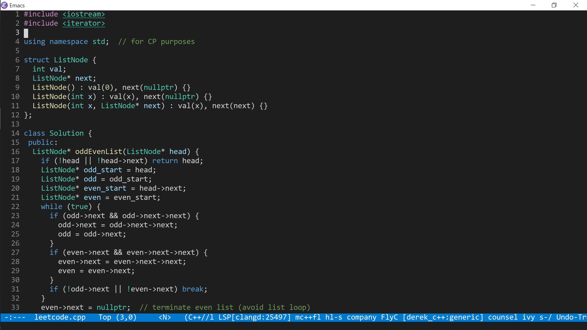
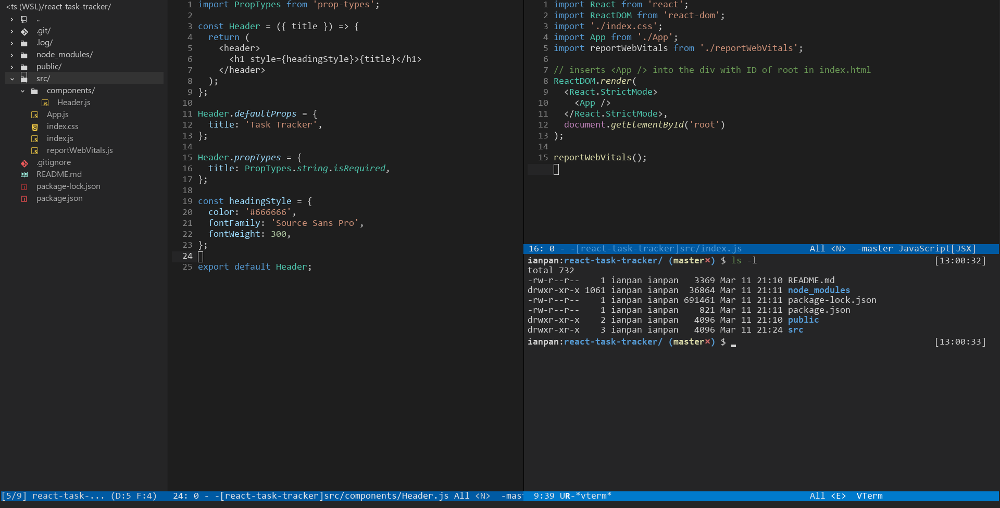
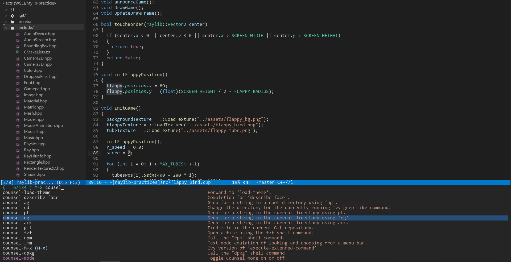

<h3 align="center">🖥 Visual Studio Code Dark+ for Emacs 🖥</h3>
<hr/>


<p align="center">
  
</p>

<p align="center">

  <a href="https://github.com/ianpan870102/vscode-dark-plus-emacs-theme">
    
  </a>

  <a href="https://github.com/ianpan870102/vscode-dark-plus-emacs-theme">
    
  </a>

  <a href="https://www.gnu.org/licenses/gpl-3.0">
    
  </a>

</p>

<br/>

<p align="center">✔ A complete port of the default Visual Studio Code Dark+ theme for Emacs</p>

<br/>



<br/>

<a href="https://github.com/ianpan870102/vscode-dark-plus-emacs-theme#more-screenshots">
  More Screenshots
</a>

<br/>

### Introduction 👋

This theme aims to be **as identical as possible** to the default
Dark+ color scheme used by Visual Studio Code. To see the original
Visual Studio Code by Microsoft in action, consider [this YouTube
video](https://www.youtube.com/watch?v=fnPhJHN0jTE).

If you find any inconsistency between Visual Studio Code's Dark+ and
my port, please **file an issue** and I'll try my best to fix it.

### Installation 🤘

#### Installation Method 1: MELPA (Recommended)

`vscode-dark-plus-theme` is now on MELPA as a package (as of 8. June. 2020)! An example use-package declaration:

```emacs-lisp
(use-package vscode-dark-plus-theme
  :ensure t
  :config
  (load-theme 'vscode-dark-plus t))
```


#### Installation Method 2: manual install

Download `vscode-dark-plus-theme.el` and put it under
`~/.emacs.d/themes/` (or `~/.config/emacs/themes/`), then add these
lines to your `init.el`:

```emacs-lisp
(add-to-list 'custom-theme-load-path "~/.emacs.d/themes/")
; or
(add-to-list 'custom-theme-load-path "~/.config/emacs/themes/")

(load-theme 'vscode-dark-plus t)
```

### Options 🧐

You can set a few options to customize some of the faces.

```emacs-lisp
;; Remove the border around the TODO word on org-mode files
(setq vscode-dark-plus-box-org-todo nil)

;; Do not set different heights for some org faces
(setq vscode-dark-plus-scale-org-faces nil)

;; Avoid inverting hl-todo face
(setq vscode-dark-plus-invert-hl-todo nil)
```

### Support for Solaire-Mode 🙃

The following snippet turns on solaire-mode support.

```emacs-lisp
(use-package solaire-mode
  :ensure t
  :config
  (solaire-global-mode +1))

(use-package vscode-dark-plus-theme
  :ensure t
  :config
  (load-theme 'vscode-dark-plus t))
```

### More Screenshots 🍀




<br/>



<br/>


<br/>
<br/>


Copyright© 2020-2021 Ian Y.E. Pan

This program is free software: you can redistribute it and/or modify
it under the terms of the GNU General Public License as published by
the Free Software Foundation, either version 3 of the License, or (at
your option) any later version.

This program is distributed in the hope that it will be useful, but
WITHOUT ANY WARRANTY; without even the implied warranty of
MERCHANTABILITY or FITNESS FOR A PARTICULAR PURPOSE. See the GNU
General Public License for more details.

You should have received a copy of the GNU General Public License
along with this program. If not, see https://www.gnu.org/licenses/.
